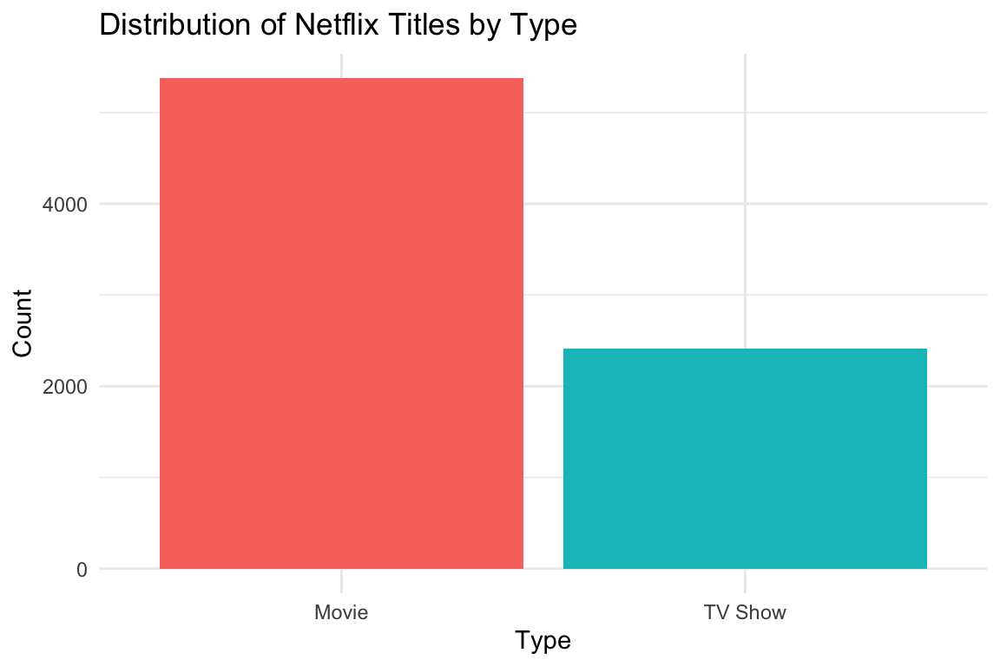
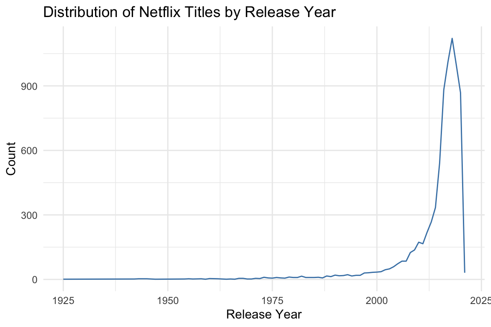
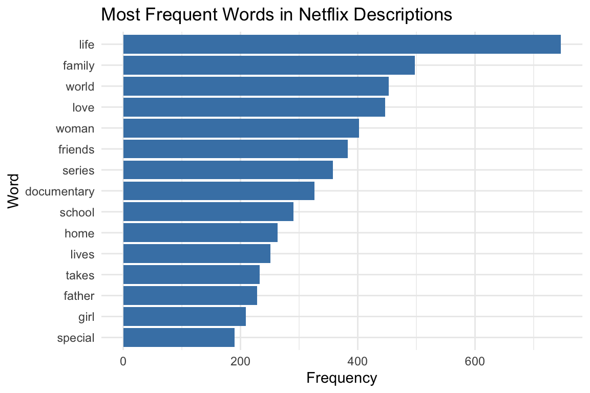
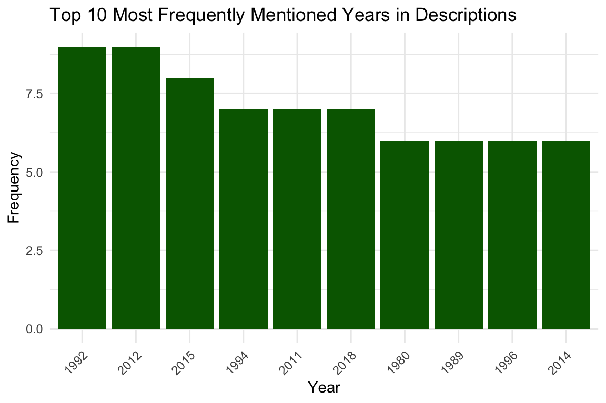
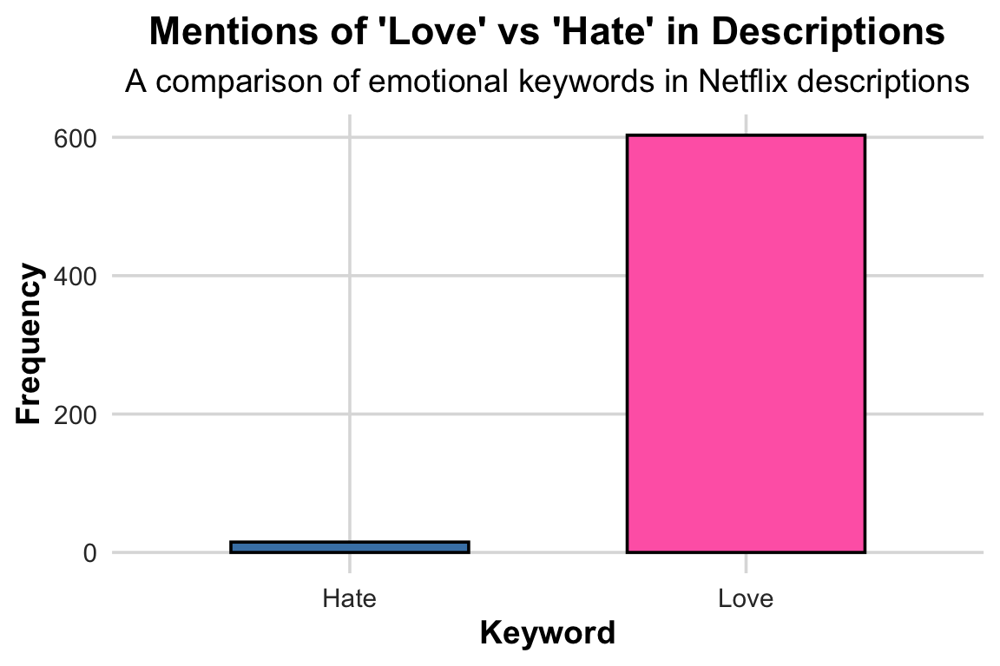

# Presentation Overview

-   **Website Overview** Personal website layout and features

-   **Netflix Title Data Analysis:**\
    Understanding thematic patterns and linguistic structure in Netflix titles and descriptions with Regex

# Website Overview

## Home Page


{style="display: block; margin: auto;"}

# Netflix Text Analysis

## Introduction to Dataset


::: {.cell}
::: {.cell-output-display}
{width=576}
:::
:::


### Visualization the distribution of release years


::: {.cell}
::: {.cell-output-display}
{width=576}
:::
:::


- **Source**: Accessed via TidyTuesday (2021-04-20).
- **Objective**: Analyze text patterns to uncover thematic and linguistic trends.


## What proportion of Netflix Titles Contain Numbers?

We begin by checking how common it is for Netflix titles to contain numbers (e.g., 13 Reasons Why, 3%). This could reflect stylistic choices aimed at emphasizing uniqueness or mystery.


::: {.cell}

```{.r .cell-code}
netflix_titles <- netflix_titles |>
  mutate(has_number = str_detect(title, "\\d+"))

table(netflix_titles$has_number)
```

::: {.cell-output .cell-output-stdout}

```

FALSE  TRUE 
 7361   426 
```


:::

```{.r .cell-code}
prop.table(table(netflix_titles$has_number))
```

::: {.cell-output .cell-output-stdout}

```

     FALSE       TRUE 
0.94529344 0.05470656 
```


:::

```{.r .cell-code}
#Here, we use the `str_detect()` function with the regular expression `\\d+` to check whether each title contains a **number** (like *13 Reasons Why* or *3%*).  
#This tells us how common numeric titles are — a pattern that can reflect marketing or thematic choices.

#The table above shows how many Netflix titles contain numbers compared to those that do not.')
```
:::


# Numeric Titles in Netflix

- Only **426 out of 7,787** Netflix titles (about **5.5%**) contain a number.
- The remaining **94.5%** do not contain numbers, making numeric titles relatively rare.
- Numeric titles are often used deliberately to:
  - Signal a **countdown** (e.g., *3%*).
  - Indicate a **sequence** (e.g., *Part 2*).
  - Highlight an **age or milestone** (e.g., *13 Reasons Why*).
  - Provide context or attract attention.

## Counting Thematic Keywords in Descriptions


::: {.cell}

```{.r .cell-code}
netflix_titles <- netflix_titles |>
  mutate(
    love_mentions    = str_count(description, "\\b(?i)love\\b"),
    death_mentions   = str_count(description, "\\b(?i)death\\b"),
    mystery_mentions = str_count(description, "\\b(?i)mystery\\b")
  )

theme_counts <- netflix_titles |>
  summarise(
    love = sum(love_mentions, na.rm = TRUE),
    death = sum(death_mentions, na.rm = TRUE),
    mystery = sum(mystery_mentions, na.rm = TRUE)
  ) |>
  pivot_longer(cols = everything(), names_to = "theme", values_to = "count") 
```
:::


## Plotting


::: {.cell}
::: {.cell-output-display}
{fig-alt='Bar chart showing total mentions of the words \'love\', \'death\', and \'mystery\' across all Netflix descriptions. Each bar represents the overall frequency of each theme, allowing comparison of how often these motifs appear in Netflix title summaries.' width=576}
:::
:::


## Finding Adjectives That Appear Before “Story” (Lookaround Example)


::: {.cell}

```{.r .cell-code}
story_words <- netflix_titles |>
  mutate(adj_before_story = str_extract(description, "\\b\\w+(?= story)")) |>
  filter(!is.na(adj_before_story)) |>
  mutate(adj_before_story = tolower(adj_before_story)) |>
  anti_join(stop_words, by = c("adj_before_story" = "word")) |>
  count(adj_before_story, sort = TRUE)

head(story_words, 10)
```

::: {.cell-output .cell-output-stdout}

```
# A tibble: 10 × 2
   adj_before_story     n
   <chr>            <int>
 1 true                48
 2 love                 8
 3 life                 5
 4 origin               3
 5 biblical             2
 6 crime                2
 7 dark                 2
 8 fictional            2
 9 age                  1
10 american             1
```


:::
:::


The use a regular expression with a lookahead — `(?= story)` — extracts the word immediately before “story” in each description.

## Most Frequent Words in Descriptions (Excluding filler)


::: {.cell}
::: {.cell-output-display}
{fig-alt='Horizontal bar chart of the 15 most common non-stop words in Netflix descriptions, showing frequency for each word. Words like \'love\', \'life\', and \'family\' appear prominently.' width=576}
:::
:::


## Extracting Years from Descriptions


::: {.cell}

```{.r .cell-code}
netflix_titles <- netflix_titles |>
  mutate(year_mentions = str_extract_all(description, "\\b(19|20)\\d{2}\\b"))

# - \\b: Matches a word boundary to ensure we're matching whole words.
# - (19|20): Matches either "19" or "20", representing the start of a year in the 1900s or 2000s.
# - \\d{2}: Matches exactly two digits, completing the year (e.g., 1999, 2020).
# - \\b: Ensures the match is a whole word, avoiding partial matches within longer strings.
```
:::


## Extracting Years from Descriptions 


::: {.cell}

```{.r .cell-code}
netflix_titles <- netflix_titles |>
  mutate(year_mentions = str_extract_all(description, "\\b(19|20)\\d{2}\\b"))

# - \\b: Matches a word boundary to ensure we're matching whole words.
# - (19|20): Matches either "19" or "20", representing the start of a year in the 1900s or 2000s.
# - \\d{2}: Matches exactly two digits, completing the year (e.g., 1999, 2020).
# - \\b: Ensures the match is a whole word, avoiding partial matches within longer strings.

year_counts <- netflix_titles |>
  unnest(year_mentions) |>
  count(year_mentions, sort = TRUE) |>
  slice_head(n = 10) # Select top 10 years
```
:::


## 


::: {.cell}
::: {.cell-output-display}
{fig-alt='Bar chart showing the frequency of the top 10 years mentioned in Netflix descriptions.' width=576}
:::
:::


## Identifying Titles with Repeated Words


::: {.cell}

```{.r .cell-code}
netflix_titles <- netflix_titles |>
  mutate(repeated_words = str_detect(title, "\\b(\\w+)\\b.*\\b\\1\\b"))
# - \\b: Matches a word boundary to ensure we're matching whole words.
# - (\\w+): Captures a sequence of word characters (letters, digits, or underscores) as a group.
# - \\b: Ensures the captured group is a whole word.
# - .*: Matches any number of characters (except newlines) between the first and second occurrence of the word.
# - \\b\\1\\b: Matches the same word captured in the first group, ensuring it's a whole word.


# Count titles with repeated words
repeated_word_counts <- netflix_titles |>
  count(repeated_words)

# Display the counts
repeated_word_counts
```

::: {.cell-output .cell-output-stdout}

```
# A tibble: 2 × 2
  repeated_words     n
  <lgl>          <int>
1 FALSE           7560
2 TRUE             227
```


:::
:::


## Extracting Sentences with "Love" or "Hate"


::: {.cell}

```{.r .cell-code}
netflix_titles <- netflix_titles |>
  mutate(love_hate_sentences = str_extract_all(description, "[A-Z][^.!?]*(love|hate)[^.!?]*[.!?]"))

# Count sentences mentioning 'love' or 'hate'
love_hate_counts <- netflix_titles |>
  unnest(love_hate_sentences) |>
  mutate(keyword = ifelse(str_detect(love_hate_sentences, "love"), "Love", "Hate")) |>
  count(keyword, sort = TRUE)
```
:::

::: {.cell}
::: {.cell-output-display}
{fig-alt='Bar chart comparing the frequency of sentences mentioning \'love\' versus \'hate\' in Netflix descriptions.' width=576}
:::
:::


# Mentions of 'Love' vs 'Hate'
-   **Love** dominates Netflix descriptions, highlighting the platform's focus on romantic and emotional themes.
-   **Hate** appears far less frequently, suggesting a lesser emphasis on negative emotions.
