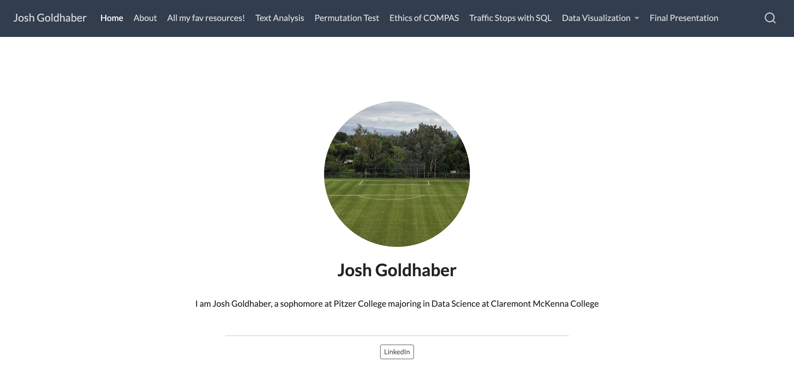
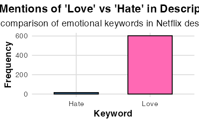

```{r setup, include=FALSE}
knitr::opts_chunk$set(
  echo = TRUE,
  warning = FALSE,
  message = FALSE,
  fig.width = 6,
  fig.height = 4
)
library(tidyverse)
library(stringr)
library(tidytext)
library(ggplot2)
library(scales)
library(magick)
library(tibble)
```

# Overview

-   **Website Overview** Personal website layout and features

-   **Netflix Title Data Analysis:**\
    Understanding thematic patterns and linguistic structure in Netflix titles and descriptions with Regex

# Website Overview

## Home Page

```{r include=FALSE}
library(magick)

homepage_img <- image_read("/Users/jgoldhaber/IntroDataScience/jogo2002.github.io/images/Homepage.png")
image_write(homepage_img, path = "Homepage.png", format = "png")
```

{style="display: block; margin: auto;"}

# Netflix Text Analysis

## Introduction to Dataset

```{r, include=FALSE}
# Display the first few rows of the raw data
netflix_titles <- readr::read_csv(
  "https://raw.githubusercontent.com/rfordatascience/tidytuesday/main/data/2021/2021-04-20/netflix_titles.csv"
)
```
```{r echo=FALSE}
# Visualize the distribution of Netflix titles by type
netflix_titles |>
  count(type) |>
  ggplot(aes(x = type, y = n, fill = type)) +
  geom_col(show.legend = FALSE) +
  labs(
    title = "Distribution of Netflix Titles by Type",
    x = "Type",
    y = "Count"
  ) +
  theme_minimal()
```

### Visualization the distribution of release years

```{r echo=FALSE}
netflix_titles |>
  count(release_year) |>
  ggplot(aes(x = release_year, y = n)) +
  geom_line(color = "steelblue") +
  labs(
    title = "Distribution of Netflix Titles by Release Year",
    x = "Release Year",
    y = "Count"
  ) +
  theme_minimal()
```


- **Source**: Accessed via TidyTuesday (2021-04-20).
- **Objective**: Analyze text patterns to uncover thematic and linguistic trends.


## What proportion of Netflix Titles Contain Numbers?

We begin by checking how common it is for Netflix titles to contain numbers (e.g., 13 Reasons Why, 3%). This could reflect stylistic choices aimed at emphasizing uniqueness or mystery.

```{r}
netflix_titles <- netflix_titles |>
  mutate(has_number = str_detect(title, "\\d+"))

table(netflix_titles$has_number)
prop.table(table(netflix_titles$has_number))


#Here, we use the `str_detect()` function with the regular expression `\\d+` to check whether each title contains a **number** (like *13 Reasons Why* or *3%*).  
#This tells us how common numeric titles are — a pattern that can reflect marketing or thematic choices.

#The table above shows how many Netflix titles contain numbers compared to those that do not.')

```

# Numeric Titles in Netflix

- Only **426 out of 7,787** Netflix titles (about **5.5%**) contain a number.
- The remaining **94.5%** do not contain numbers, making numeric titles relatively rare.
- Numeric titles are often used deliberately to:
  - Signal a **countdown** (e.g., *3%*).
  - Indicate a **sequence** (e.g., *Part 2*).
  - Highlight an **age or milestone** (e.g., *13 Reasons Why*).
  - Provide context or attract attention.

## Counting Thematic Keywords in Descriptions

```{r}
netflix_titles <- netflix_titles |>
  mutate(
    love_mentions    = str_count(description, "\\b(?i)love\\b"),
    death_mentions   = str_count(description, "\\b(?i)death\\b"),
    mystery_mentions = str_count(description, "\\b(?i)mystery\\b")
  )

theme_counts <- netflix_titles |>
  summarise(
    love = sum(love_mentions, na.rm = TRUE),
    death = sum(death_mentions, na.rm = TRUE),
    mystery = sum(mystery_mentions, na.rm = TRUE)
  ) |>
  pivot_longer(cols = everything(), names_to = "theme", values_to = "count") 
```

## Plotting

```{r echo=FALSE}
#| fig-alt: "Bar chart showing total mentions of the words 'love', 'death', and 'mystery' across all Netflix descriptions. Each bar represents the overall frequency of each theme, allowing comparison of how often these motifs appear in Netflix title summaries."

ggplot(theme_counts, aes(x = theme, y = count, fill = theme)) +
  geom_col() +
  labs(
    title = "Common Themes in Netflix Descriptions",
    x = "Theme",
    y = "Count of Mentions",
    fill = "Theme"
  ) +
  theme_minimal()
```


## Finding Adjectives That Appear Before “Story” (Lookaround Example)

```{r}
story_words <- netflix_titles |>
  mutate(adj_before_story = str_extract(description, "\\b\\w+(?= story)")) |>
  filter(!is.na(adj_before_story)) |>
  mutate(adj_before_story = tolower(adj_before_story)) |>
  anti_join(stop_words, by = c("adj_before_story" = "word")) |>
  count(adj_before_story, sort = TRUE)

head(story_words, 10)
```

The use a regular expression with a lookahead — `(?= story)` — extracts the word immediately before “story” in each description.

## Most Frequent Words in Descriptions (Excluding filler)

```{r echo=FALSE}
#| fig-alt: "Horizontal bar chart of the 15 most common non-stop words in Netflix descriptions, showing frequency for each word. Words like 'love', 'life', and 'family' appear prominently."
data("stop_words")

top_words <- netflix_titles |>
  unnest_tokens(word, description) |>
  anti_join(stop_words, by = "word") |>
  count(word, sort = TRUE) |>
  slice_head(n = 15)

ggplot(top_words, aes(x = reorder(word, n), y = n)) +
  geom_col(fill = "steelblue") +
  coord_flip() +
  labs(
    title = "Most Frequent Words in Netflix Descriptions",
    x = "Word",
    y = "Frequency"
  ) +
  theme_minimal()
```

<!--  -->

# Additional Regex Explorations

## Extracting Years from Descriptions

## Extracting Years from Descriptions
 ```{r}
netflix_titles <- netflix_titles |>
  mutate(year_mentions = str_extract_all(description, "\\b(19|20)\\d{2}\\b"))
```
## Extracting Years from Descriptions 
```{r}
netflix_titles <- netflix_titles |>
  mutate(year_mentions = str_extract_all(description, "\\b(19|20)\\d{2}\\b"))
```
# Count the frequency of years
year_counts <- netflix_titles |>
  unnest(year_mentions) |>
  count(year_mentions, sort = TRUE) |>
  slice_head(n = 10) # Select top 10 years
```{r echo=FALSE}
#| fig-alt: "Bar chart showing the frequency of the top 10 years mentioned in Netflix descriptions."
#| 

# Plot the most frequently mentioned years
ggplot(year_counts, aes(x = reorder(year_mentions, -n), y = n)) +
  geom_col(fill = "darkgreen") +
  labs(
    title = "Top 10 Most Frequently Mentioned Years in Descriptions",
    x = "Year",
    y = "Frequency"
  ) +
  theme_minimal() +
  theme(axis.text.x = element_text(angle = 45, hjust = 1))
```

## Identifying Titles with Repeated Words

```{r}
netflix_titles <- netflix_titles |>
  mutate(repeated_words = str_detect(title, "\\b(\\w+)\\b.*\\b\\1\\b"))

# Count titles with repeated words
repeated_word_counts <- netflix_titles |>
  count(repeated_words)

# Display the counts
repeated_word_counts
```

## Extracting Sentences with "Love" or "Hate"

```{r echo=FALSE}
#| fig-alt: "Bar chart comparing the frequency of sentences mentioning 'love' versus 'hate' in Netflix descriptions."
netflix_titles <- netflix_titles |>
  mutate(love_hate_sentences = str_extract_all(description, "[A-Z][^.!?]*(love|hate)[^.!?]*[.!?]"))

# Count sentences mentioning 'love' or 'hate'
love_hate_counts <- netflix_titles |>
  unnest(love_hate_sentences) |>
  mutate(keyword = ifelse(str_detect(love_hate_sentences, "love"), "Love", "Hate")) |>
  count(keyword, sort = TRUE)

# Plot the counts
ggplot(love_hate_counts, aes(x = keyword, y = n, fill = keyword)) +
  geom_col(width = 0.6, color = "black", show.legend = FALSE) +
  scale_fill_manual(values = c("Love" = "#FF69B4", "Hate" = "#4682B4")) +
  scale_y_continuous(labels = comma) +
  labs(
    title = "Mentions of 'Love' vs 'Hate' in Descriptions",
    subtitle = "A comparison of emotional keywords in Netflix descriptions",
    x = "Keyword",
    y = "Frequency"
  ) +
  theme_minimal(base_size = 14) +
  theme(
    plot.title = element_text(face = "bold", hjust = 0.5),
    plot.subtitle = element_text(hjust = 0.5),
    axis.text = element_text(color = "#333333"),
    axis.title = element_text(face = "bold"),
    panel.grid.major = element_line(color = "#DDDDDD"),
    panel.grid.minor = element_blank()
  )
```

## Mentions of 'Love' vs 'Hate'

```{r}
love_hate_img <- image_read("/Users/jgoldhaber/IntroDataScience/jogo2002.github.io/images/LoveVHate.png")
image_write(love_hate_img, path = "LoveVsHate.png", format = "png")
```



-   **Love** dominates Netflix descriptions, highlighting the platform's focus on romantic and emotional themes.
-   **Hate** appears far less frequently, suggesting a lesser emphasis on negative emotions.